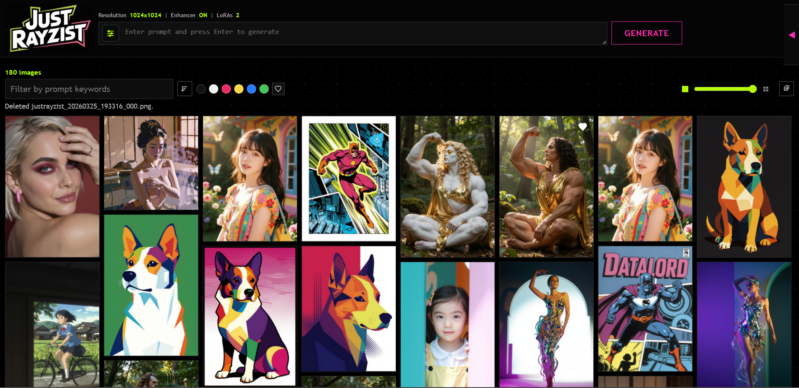
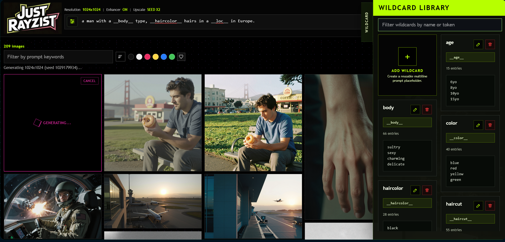
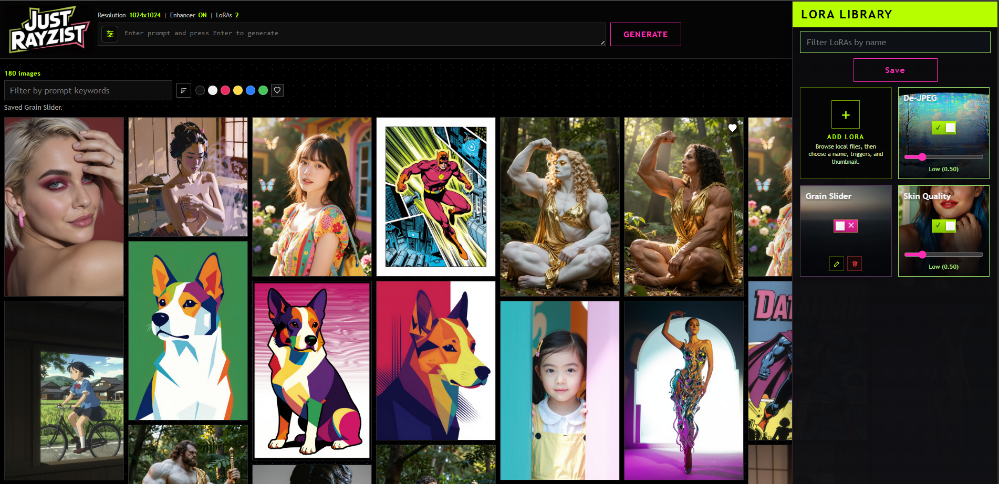

# JustRayzist



JustRayzist is a local-first image generation app built around the Rayzist Z-Image Turbo fine-tune. It ships a FastAPI backend, a browser UI, a Typer CLI, bundled launch scripts, model-pack metadata, and supporting workflows for gallery management, LoRA libraries, wildcard libraries, prompt enhancement, and x2 SeedVR2 upscaling.

The project is designed to run offline after setup. Normal user flows stay on a stable `balanced` runtime baseline while the app auto-detects an internal `resource_tier` (`high`, `balanced`, or `constrained`) from current free VRAM and adjusts execution strategy without asking the user to pick a memory mode on startup.

## New in v1.8.6

- Adds the optional `Rayzist_qwen3_4b_fp8` encoder pack using [MutantSparrow/qwen3_4b_Rayzist_v1.0_fp8](https://huggingface.co/MutantSparrow/qwen3_4b_Rayzist_v1.0_fp8).
- Converts scaled FP8 Qwen3 text-encoder tensors to BF16 at runtime so the pack can use the normal Z-Image Turbo pipeline.
- Adds installer prompts and manual fetch flags for the optional encoder while keeping default installs on `Rayzist_bf16`.





## Features

- Local web UI, local API, and CLI in one repository.
- Auto resource-tier detection with stable normal-user defaults.
- Model-pack based runtime with public, hidden, disabled, and derived runtime pack behavior.
- Multi-LoRA workflow with draft upload, trigger detection, thumbnails, and per-request weights.
- Wildcard library with editable prompt tokens and encoder-assisted suggestion generation.
- Gallery indexing with favorites, dominant-color filters, bulk download, rebuild, and import-from-source support.
- Prompt enhancement and Creative Mode (`procedural_creativity` values `0-3`).
- `R+` alternate staged inference mode with vibrance and bias controls.
- Content-aware x2 upscale with photo or illustration routing, tiled seam repair, and photo-only FS finishing.
- Source-mode launchers for Windows, Linux, and macOS.
- Windows packaging and in-place packaged update flow.


## Tech Stack

- Python 3.11+
- FastAPI + Uvicorn
- Typer
- PyTorch
- Diffusers, Transformers, Accelerate
- Pillow
- SQLite
- PowerShell and Python helper scripts for setup and release tasks

## Requirements

- Windows is the primary supported workflow for packaged installs and release engineering.
- Linux and macOS source mode are supported through `RunMeFirst.sh` and `StartWeb.sh`.
- An NVIDIA GPU is strongly recommended for practical performance.
- macOS support is best-effort source setup only.
- Internet access is required for first-time setup and model/runtime downloads.

CUDA lane baseline:

- `cu126`: NVIDIA driver `>= 561.17`
- `cu128`: NVIDIA driver `>= 572.61`

The bundled default public pack is `Rayzist_bf16`. Setup can also fetch `Rayzist_qwen3_4b_fp8`, which reuses the `Rayzist_bf16` transformer and VAE and replaces only the text encoder with [Qwen3 4B FP8 Rayzist](https://huggingface.co/MutantSparrow/qwen3_4b_Rayzist_v1.0_fp8). Scaled FP8 text-encoder tensors are converted to BF16 at runtime. Important: native FP8 inference is not implemented in the current release.

## Installation

Preferred setup from repository root:

Windows:

```powershell
.\RunMeFirst.bat
```

Linux and macOS source mode:

```bash
./RunMeFirst.sh
```

What setup does:

- Creates or repairs `.venv`.
- Installs runtime, SeedVR2, and development dependencies.
- Installs Hugging Face CLI with XET support.
- Fetches the bundled default model assets.
- Offers the optional `Rayzist_qwen3_4b_fp8` encoder pack download.
- Fetches the SeedVR2 runtime repository.
- Runs `doctor` and `validate-models` sanity checks.

Manual alternatives:

```powershell
powershell -ExecutionPolicy Bypass -File scripts\bootstrap_env.ps1 -PythonExe C:\Path\To\python.exe -Lane cu128
powershell -ExecutionPolicy Bypass -File scripts\fetch_model_assets.ps1
powershell -ExecutionPolicy Bypass -File scripts\fetch_model_assets.ps1 -IncludeQwen3Fp8Encoder
powershell -ExecutionPolicy Bypass -File scripts\fetch_seedvr2_runtime.ps1
```

```bash
python3 scripts/portable/bootstrap_env.py --python-exe python3 --lane auto
python3 scripts/portable/fetch_model_assets.py
python3 scripts/portable/fetch_model_assets.py --include-qwen3-4b-fp8-encoder
python3 scripts/portable/fetch_seedvr2_runtime.py
```

## Quick Start

Windows:

```powershell
.\StartWeb.bat
```

Linux and macOS source mode:

```bash
./StartWeb.sh
```

Launcher behavior:

1. Select a pack only when more than one public enabled pack is installed.
2. Select local-only or LAN listen mode.
3. Let the app auto-detect the internal `resource_tier` from free VRAM.
4. Open `http://127.0.0.1:37717/`.

`StartWeb.sh` accepts `--host`, `--port`, and `--pack`. If more than one public enabled pack exists and no TTY is available, provide `--pack` or set `JUSTRAYZIST_PACK`.

## Packaged Update

If you are running from a packaged Windows release folder instead of a git checkout:

```powershell
.\UpdateApp.bat
```

The updater preserves `models/`, `outputs/`, `data/`, `.venv/`, and the local lane marker while replacing the shipped app files from the latest matching release.

## Configuration

Environment variables used by launchers, source mode, or diagnostics:

- `JUSTRAYZIST_ROOT`: override the workspace root.
- `JUSTRAYZIST_PACK`: default model pack name.
- `JUSTRAYZIST_OFFLINE`: `1` by default; enables offline runtime guards.
- `JUSTRAYZIST_ENV`: environment label, `dev` by default.
- `JUSTRAYZIST_LISTEN`: set to `1` to force LAN listen mode from `StartWeb.bat` or `StartWeb.sh`.
- `JUSTRAYZIST_PYTHON`: optional interpreter override for source-mode launchers.
- `JUSTRAYZIST_SKIP_GPU_PREFLIGHT`: set to `1` to bypass packaged GPU lane preflight.
- `JUSTRAYZIST_INCLUDE_QWEN3_FP8_ENCODER`: set to `1` to include the optional Qwen3 FP8 encoder pack during setup without prompting.
- `JUSTRAYZIST_PROFILE`: engineering-only runtime tier override for diagnostics and benchmark workflows.

Normal startup does not ask users to choose `high`, `balanced`, or `constrained`. The stable `runtime_profile` baseline remains `balanced`; the mutable `resource_tier` reports the memory strategy the app selected for the current hardware state.

## Usage Examples

Basic status and validation:

```powershell
python -m app.cli.main status
python -m app.cli.main doctor
python -m app.cli.main validate-models
python -m app.cli.main validate-models --all
```

Serve the app directly:

```powershell
python -m app.cli.main serve --host 127.0.0.1 --port 37717
```

Generate an image:

```powershell
python -m app.cli.main generate --pack Rayzist_bf16 --prompt "cinematic skyline at sunrise"
```

Run a soak session and inspect reports:

```powershell
python -m app.cli.main soak --pack Rayzist_bf16 --prompt "stress prompt" --iterations 20
python -m app.cli.main soak-report --list-sessions
```

Engineering-only comparison and benchmark commands:

```powershell
python -m app.cli.main pack-compare --prompt "cinematic skyline at sunrise"
python -m app.cli.main pack-compare-suite --iterations 3
python -m app.cli.main prompt-grid-benchmark --pack Rayzist_bf16 --prompt "PROMPT 1" --prompt "PROMPT 2" --prompt "PROMPT 3"
python -m app.cli.main seedvr2-still-benchmark --inputs outputs\sample.png --presets seed_faithful,seed_sharp --runtime-preset current_baseline
python -m app.cli.main procedural-latent-preview --count 16 --seed-start 1 --creativity 2
```

The editable install also exposes the `justrayzist` console entry point.

## API Summary

Base URL: `http://127.0.0.1:37717`

Key API behavior:

- Client-scoped routes require `X-JustRayzist-Client`.
- UI presets go up to `1536x1536`; raw API requests allow up to `2048x2048`.
- `procedural_creativity` controls Creative Mode with values `0-3`.
- `scheduler_mode` remains optional for raw API and CLI usage.
- `GET /health` and `GET /config` report both `runtime_profile` and `resource_tier`.
- `GET /model-packs` returns public enabled packs only.
- `POST /server/kill` and `POST /server/restart` are restricted to the local machine hosting the app.

<!-- BEGIN GENERATED API ROUTES -->
- `GET /health`
- `GET /config`
- `GET /model-packs`
- `GET /loras`
- `GET /wildcards`
- `POST /wildcards`
- `PATCH /wildcards/{wildcard_id}`
- `DELETE /wildcards/{wildcard_id}`
- `POST /wildcards/suggestions`
- `GET /chat/history`
- `DELETE /chat/history`
- `POST /chat`
- `POST /lora-drafts`
- `POST /lora-drafts/{draft_id}/detect-triggers`
- `POST /loras`
- `PATCH /loras/{lora_id}`
- `GET /loras/{lora_id}/preview`
- `DELETE /loras/{lora_id}`
- `POST /generate`
- `POST /img2img`
- `POST /upscale`
- `POST /clarity`
- `POST /images/download-zip`
<!-- END GENERATED API ROUTES -->

`GET /API` serves the built-in API explorer and tester.

<!-- BEGIN GENERATED API EXAMPLES -->
### `GET /health`

Service health plus current baseline/defaults and detected memory strategy.

Sample response:

```json
{
  "status": "ok",
  "app": "JustRayzist",
  "version": "1.8.6",
  "runtime_profile": "balanced",
  "resource_tier": "high",
  "active_pack": "Rayzist_bf16",
  "selected_pack": "Rayzist_bf16",
  "effective_pack": "Rayzist_bf16",
  "active_backend": "diffusers_zimage",
  "fp8_fallback_used": false,
  "fp8_fallback_reason": null,
  "fp8_runtime_mode": null,
  "fp8_storage_preserved_tensor_count": 0,
  "fp8_promoted_tensor_count": 0,
  "lora_capable": true,
  "wildcard_suggestions_capable": true,
  "gallery_color_cache_active": false,
  "gallery_color_cache_version": "dominant_v6",
  "gallery_color_cache_target_version": "dominant_v6",
  "gallery_color_cache_error": null,
  "offline_mode": true
}
```

### `GET /config`

Resolved runtime configuration, paths, and current runtime status.

Sample response:

```json
{
  "app_name": "JustRayzist",
  "app_version": "1.8.6",
  "environment": "dev",
  "offline_mode": true,
  "runtime_profile": {
    "name": "balanced",
    "description": "16GB-class profile with moderate offload and stable throughput."
  },
  "resource_tier": {
    "name": "high",
    "description": "24GB-class profile with minimal offload and highest throughput."
  },
  "resource_tier_override": null,
  "auto_resource_tier": true,
  "paths": {
    "root_dir": "S:\\STABLEDIFFUSION\\JustRayzist",
    "models_dir": "S:\\STABLEDIFFUSION\\JustRayzist\\models",
    "model_packs_dir": "S:\\STABLEDIFFUSION\\JustRayzist\\models\\packs",
    "outputs_dir": "S:\\STABLEDIFFUSION\\JustRayzist\\outputs",
    "data_dir": "S:\\STABLEDIFFUSION\\JustRayzist\\data",
    "ui_dir": "S:\\STABLEDIFFUSION\\JustRayzist\\app\\ui"
  },
  "runtime": {
    "runtime_profile": "balanced",
    "resource_tier": "high",
    "resource_tier_description": "24GB-class profile with minimal offload and highest throughput.",
    "resource_tier_override": null,
    "auto_resource_tier": true,
    "active_pack": "Rayzist_bf16",
    "selected_pack": "Rayzist_bf16",
    "effective_pack": "Rayzist_bf16",
    "active_backend": "diffusers_zimage",
    "execution_mode": "model_offload",
    "fp8_checkpoint": false,
    "fp8_fallback_used": false,
    "fp8_fallback_reason": null,
    "fp8_runtime_mode": null,
    "fp8_normalized_tensor_count": 0,
    "fp8_storage_preserved_tensor_count": 0,
    "fp8_promoted_tensor_count": 0,
    "lora_capable": true,
    "wildcard_suggestions_capable": true,
    "gallery_color_cache_active": false,
    "gallery_color_cache_version": "dominant_v6",
    "gallery_color_cache_target_version": "dominant_v6",
    "gallery_color_cache_error": null
  }
}
```

### `GET /model-packs`

List discovered, valid, public, and enabled model packs.

Sample response:

```json
{
  "count": 1,
  "items": [
    {
      "name": "Rayzist_bf16",
      "path": "S:\\STABLEDIFFUSION\\JustRayzist\\models\\packs\\Rayzist_bf16\\modelpack.yaml",
      "architecture": "z_image_turbo"
    }
  ]
}
```

### `GET /loras`

List installed LoRAs, preview URLs, saved trigger words, detected trigger suggestions, and runtime LoRA capabilities.

Sample response:

```json
{
  "count": 1,
  "items": [
    {
      "id": "cinematic-style",
      "display_name": "cinematic-style",
      "source_filename": "cinematic-style.safetensors",
      "preview_url": "/loras/cinematic-style/preview",
      "trigger_words": [
        "cinematic style"
      ],
      "detected_trigger_words": [
        "cinematic style",
        "moody light"
      ],
      "preview_is_custom": true,
      "metadata_summary": {
        "ss_output_name": "cinematic-style"
      },
      "file_size_bytes": 12345678
    }
  ],
  "capabilities": {
    "supported": true,
    "active_pack": "Rayzist_bf16",
    "max_active": 3,
    "min_weight": -2.0,
    "max_weight": 2.0,
    "default_weight": 1.0
  }
}
```

### `GET /wildcards`

List installed wildcards, their editable prompt tokens, multiline content, and runtime wildcard capabilities.

Sample response:

```json
{
  "count": 1,
  "items": [
    {
      "id": "3c03cc4d8cf5476e831d6603626d7843",
      "display_name": "Picturesque Locations",
      "token": "picturesque-locations",
      "placeholder": "__picturesque-locations__",
      "content_text": "a cabin in the Schwarzwald\na chalet in the French Alps",
      "entry_count": 2,
      "created_at": "2026-04-08T12:00:00+00:00",
      "updated_at": "2026-04-08T12:00:00+00:00"
    }
  ],
  "capabilities": {
    "supported": true,
    "active_pack": "Rayzist_bf16",
    "suggestions_supported": true
  }
}
```

### `POST /wildcards`

Create one wildcard with a display name, editable prompt token, and multiline entries.

Sample request body:

```json
{
  "display_name": "Picturesque Locations",
  "token": "picturesque-locations",
  "content_text": "a cabin in the Schwarzwald\na chalet in the French Alps"
}
```

Sample response:

```json
{
  "status": "ok",
  "item": {
    "id": "3c03cc4d8cf5476e831d6603626d7843",
    "display_name": "Picturesque Locations",
    "token": "picturesque-locations",
    "placeholder": "__picturesque-locations__",
    "content_text": "a cabin in the Schwarzwald\na chalet in the French Alps",
    "entry_count": 2,
    "created_at": "2026-04-08T12:00:00+00:00",
    "updated_at": "2026-04-08T12:00:00+00:00"
  },
  "capabilities": {
    "supported": true,
    "active_pack": "Rayzist_bf16",
    "suggestions_supported": true
  }
}
```

### `PATCH /wildcards/{wildcard_id}`

Update one wildcard's display name, editable prompt token, and multiline entries.

Sample request body:

```json
{
  "display_name": "Picturesque Locations",
  "token": "picturesque-locations",
  "content_text": "a cabin in the Schwarzwald\na chalet in the French Alps\na white sandy beach in Bora-Bora"
}
```

Sample response:

```json
{
  "status": "ok",
  "item": {
    "id": "3c03cc4d8cf5476e831d6603626d7843",
    "display_name": "Picturesque Locations",
    "token": "picturesque-locations",
    "placeholder": "__picturesque-locations__",
    "content_text": "a cabin in the Schwarzwald\na chalet in the French Alps\na white sandy beach in Bora-Bora",
    "entry_count": 3,
    "created_at": "2026-04-08T12:00:00+00:00",
    "updated_at": "2026-04-08T12:10:00+00:00"
  }
}
```

### `DELETE /wildcards/{wildcard_id}`

Delete one wildcard definition from the library.

Sample response:

```json
{
  "status": "ok",
  "id": "3c03cc4d8cf5476e831d6603626d7843",
  "deleted": true
}
```

### `POST /wildcards/suggestions`

Ask the active text encoder for 10 wildcard entry suggestions that match a theme and stay within the example-length constraint.

Sample request body:

```json
{
  "theme": "picturesque locations",
  "format_example": "a cabin in the Schwarzwald",
  "seed": 123456,
  "existing_entries": [
    "a cabin in the Schwarzwald"
  ]
}
```

Sample response:

```json
{
  "status": "ok",
  "suggestions": [
    "a chalet in the French Alps",
    "a white sandy beach in Bora-Bora",
    "a small cafe in a Parisian side street"
  ],
  "accepted_count": 3,
  "target_count": 10,
  "seed": 123456,
  "example_word_count": 5,
  "min_words": 5,
  "max_words": 5,
  "partial": true,
  "message": "Returned a partial set because the example-length filter was restrictive."
}
```

### `GET /chat/history`

Load the per-client Rayzist Chat history and active encoder label.

Requires `X-JustRayzist-Client`.

Sample response:

```json
{
  "status": "ok",
  "history": {
    "owner_id": "example-client",
    "next_number": 3,
    "exchange_count": 1,
    "exchanges": [
      {
        "user": {
          "number": 1,
          "role": "user",
          "content": "Help me make this prompt moodier.",
          "created_at": "2026-04-08T12:00:00+00:00",
          "error": false
        },
        "assistant": {
          "number": 2,
          "role": "assistant",
          "content": "Add stronger lighting contrast, specific weather, and camera framing.",
          "created_at": "2026-04-08T12:00:05+00:00",
          "error": false,
          "actions": [
            {
              "type": "set_prompt",
              "label": "Use Prompt",
              "prompt": "rainy neon city street, reflected signs, low camera angle"
            }
          ]
        }
      }
    ]
  },
  "capabilities": {
    "supported": true,
    "active_pack": "Rayzist_bf16",
    "encoder": "text_encoder.gguf"
  }
}
```

### `DELETE /chat/history`

Clear the per-client Rayzist Chat JSON history.

Requires `X-JustRayzist-Client`.

Sample response:

```json
{
  "status": "ok",
  "history": {
    "owner_id": "example-client",
    "next_number": 1,
    "exchange_count": 0,
    "exchanges": []
  },
  "capabilities": {
    "supported": true,
    "active_pack": "Rayzist_bf16",
    "encoder": "text_encoder.gguf"
  }
}
```

### `POST /chat`

Send one Rayzist Chat message through the active text encoder and append the numbered exchange to local JSON history.

Requires `X-JustRayzist-Client`.

Sample request body:

```json
{
  "message": "Give me three ways to improve a rainy city prompt.",
  "app_state": {
    "current_prompt": "rainy city street",
    "resolution": "1024x1024",
    "prompt_enhance": true,
    "queue_status": "0/5"
  },
  "max_new_tokens": 256,
  "temperature": 0.75
}
```

Sample response:

```json
{
  "status": "ok",
  "exchange": {
    "user": {
      "number": 1,
      "role": "user",
      "content": "Give me three ways to improve a rainy city prompt.",
      "created_at": "2026-04-08T12:00:00+00:00",
      "error": false
    },
    "assistant": {
      "number": 2,
      "role": "assistant",
      "content": "Specify rain intensity, reflected neon, street materials, and camera height.",
      "created_at": "2026-04-08T12:00:08+00:00",
      "error": false,
      "actions": [
        {
          "type": "set_prompt",
          "label": "Use Prompt",
          "prompt": "rainy neon city street, wet asphalt, reflected signs, low camera angle"
        },
        {
          "type": "open_route",
          "label": "Open API",
          "href": "/API"
        }
      ]
    }
  },
  "history": {
    "owner_id": "example-client",
    "next_number": 3,
    "exchange_count": 1
  },
  "capabilities": {
    "supported": true,
    "active_pack": "Rayzist_bf16",
    "encoder": "text_encoder.gguf"
  },
  "seed": 123456,
  "encoder": "text_encoder.gguf",
  "actions": [
    {
      "type": "set_prompt",
      "label": "Use Prompt",
      "prompt": "rainy neon city street, wet asphalt, reflected signs, low camera angle"
    },
    {
      "type": "open_route",
      "label": "Open API",
      "href": "/API"
    }
  ]
}
```

### `POST /lora-drafts`

Upload one `.safetensors` LoRA into draft storage for metadata inspection before saving it into the live library. LoRA uploads are capped at 10 GiB.

Sample request body:

```text
multipart/form-data with one file field named `file`
```

Sample response:

```json
{
  "status": "ok",
  "draft": {
    "draft_id": "cinematic-style",
    "display_name": "cinematic-style",
    "source_filename": "cinematic-style.safetensors",
    "detected_trigger_words": [
      "cinematic style",
      "moody light"
    ],
    "metadata_summary": {
      "ss_output_name": "cinematic-style"
    },
    "file_size_bytes": 12345678
  }
}
```

### `POST /lora-drafts/{draft_id}/detect-triggers`

Re-scan a staged LoRA draft for trigger words and metadata suggestions.

Sample response:

```json
{
  "status": "ok",
  "draft": {
    "draft_id": "cinematic-style",
    "display_name": "cinematic-style",
    "source_filename": "cinematic-style.safetensors",
    "detected_trigger_words": [
      "cinematic style",
      "moody light"
    ],
    "metadata_summary": {
      "ss_output_name": "cinematic-style"
    },
    "file_size_bytes": 12345678
  }
}
```

### `POST /loras`

Finalize a staged LoRA draft into the live library with a chosen name, saved trigger words, and an optional thumbnail image. Thumbnail uploads are capped at 10 MiB.

Sample request body:

```text
multipart/form-data with `draft_id`, `display_name`, `trigger_words` (JSON string), and optional `thumbnail` image
```

Sample response:

```json
{
  "status": "ok",
  "item": {
    "id": "cinematic-style",
    "display_name": "Cinematic Style",
    "source_filename": "cinematic-style.safetensors",
    "preview_url": "/loras/cinematic-style/preview",
    "preview_is_custom": true,
    "trigger_words": [
      "cinematic style",
      "moody light"
    ],
    "detected_trigger_words": [
      "cinematic style",
      "moody light"
    ],
    "metadata_summary": {
      "ss_output_name": "cinematic-style"
    },
    "file_size_bytes": 12345678
  },
  "capabilities": {
    "supported": true,
    "active_pack": "Rayzist_bf16",
    "max_active": 3,
    "min_weight": -2.0,
    "max_weight": 2.0,
    "default_weight": 1.0
  }
}
```

### `PATCH /loras/{lora_id}`

Update the display name, saved trigger words, and optional thumbnail image for one installed LoRA without replacing the weights file. Thumbnail uploads are capped at 10 MiB.

Sample request body:

```text
multipart/form-data with `display_name`, `trigger_words` (JSON string), and optional `thumbnail` image
```

Sample response:

```json
{
  "status": "ok",
  "item": {
    "id": "cinematic-style",
    "display_name": "Cinematic Style",
    "source_filename": "cinematic-style.safetensors",
    "preview_url": "/loras/cinematic-style/preview",
    "preview_is_custom": true,
    "trigger_words": [
      "cinematic style",
      "moody light"
    ],
    "detected_trigger_words": [
      "cinematic style",
      "moody light"
    ],
    "metadata_summary": {
      "ss_output_name": "cinematic-style"
    },
    "file_size_bytes": 12345678
  }
}
```

### `GET /loras/{lora_id}/preview`

Download the current preview image for one installed LoRA.

Sample response:

```text
PNG binary response
```

### `DELETE /loras/{lora_id}`

Delete one installed LoRA plus its sidecar JSON and preview image.

Sample response:

```json
{
  "status": "ok",
  "id": "cinematic-style",
  "deleted_files": 3
}
```

### `POST /generate`

Generate one image from prompt and dimensions in the current client scope.

Requires `X-JustRayzist-Client`.

Sample request body:

```json
{
  "job_id": "pending_1712345678901_abcd1234",
  "prompt": "A cinematic skyline at sunrise",
  "width": 1024,
  "height": 1024,
  "pack": "Rayzist_bf16",
  "seed": 123456,
  "scheduler_mode": "euler",
  "enhance_prompt": false,
  "procedural_creativity": 0,
  "loras": [
    {
      "id": "cinematic-style",
      "weight": 1.0
    }
  ]
}
```

Sample response:

```json
{
  "filename": "justrayzist_YYYYMMDD_hhmmss_000.png",
  "output_path": "S:\\STABLEDIFFUSION\\JustRayzist\\outputs\\example-client\\justrayzist_YYYYMMDD_hhmmss_000.png",
  "prompt": "A cinematic skyline at sunrise",
  "prompt_original": "A cinematic skyline at sunrise with __picturesque-locations__",
  "prompt_wildcard_resolved": "A cinematic skyline at sunrise with a chalet in the French Alps",
  "width": 1024,
  "height": 1024,
  "duration_ms": 12345,
  "url": "/images/justrayzist_YYYYMMDD_hhmmss_000.png",
  "prompt_enhanced": false,
  "prompt_effective_base": "A cinematic skyline at sunrise with a chalet in the French Alps",
  "prompt_effective": "A cinematic skyline at sunrise with a chalet in the French Alps, cinematic style",
  "scheduler_mode": "euler",
  "procedural_creativity": 0,
  "wildcard_count": 1,
  "wildcards": [
    {
      "id": "3c03cc4d8cf5476e831d6603626d7843",
      "display_name": "Picturesque Locations",
      "token": "picturesque-locations",
      "placeholder": "__picturesque-locations__",
      "selected_entry": "a chalet in the French Alps",
      "occurrence_index": 0,
      "prompt_offset": 31
    }
  ],
  "lora_count": 1,
  "loras": [
    {
      "id": "cinematic-style",
      "name": "cinematic-style",
      "weight": 1.0
    }
  ]
}
```

### `POST /img2img`

Generate one variation from a reference image upload plus prompt and similarity.

Requires `X-JustRayzist-Client`.

Sample request fields (`multipart/form-data`):

```json
{
  "image": "<binary image upload>",
  "prompt": "A cinematic skyline at sunrise",
  "pack": "Rayzist_bf16",
  "job_id": "pending_img2img_1712345678901_abcd1234",
  "seed": 123456,
  "scheduler_mode": "euler",
  "enhance_prompt": false,
  "similarity": 0.8,
  "loras": [
    {
      "id": "cinematic-style",
      "weight": 1.0
    }
  ]
}
```

Sample response:

```json
{
  "filename": "justrayzist_YYYYMMDD_hhmmss_001.png",
  "mode": "img2img",
  "source_filename": "reference.png",
  "source_width": 1024,
  "source_height": 768,
  "similarity": 0.8,
  "duration_ms": 12345,
  "url": "/images/justrayzist_YYYYMMDD_hhmmss_001.png",
  "prompt_enhanced": false,
  "prompt_effective_base": "A cinematic skyline at sunrise with a chalet in the French Alps",
  "prompt_effective": "A cinematic skyline at sunrise with a chalet in the French Alps, cinematic style",
  "scheduler_mode": "euler",
  "wildcard_count": 1,
  "lora_count": 1
}
```

### `POST /upscale`

Upscale one gallery image with the content-aware x2 path for photos and illustration.

Requires `X-JustRayzist-Client`.

Sample request body:

```json
{
  "job_id": "pending_upscale_1712345678901_abcd1234",
  "filename": "justrayzist_YYYYMMDD_hhmmss_000.png",
  "pack": "Rayzist_bf16",
  "seed": 123456,
  "scheduler_mode": "euler",
  "enhance_prompt": false
}
```

Sample response:

```json
{
  "filename": "justrayzist_YYYYMMDD_hhmmss_001.png",
  "mode": "api_upscale",
  "source_filename": "justrayzist_YYYYMMDD_hhmmss_000.png",
  "upscale_engine": "content_aware_ai_x2",
  "execution_mode": "content_aware_ai_x2",
  "duration_ms": 23456,
  "url": "/images/justrayzist_YYYYMMDD_hhmmss_001.png"
}
```

### `POST /clarity`

Run the multiband clarity pipeline on one gallery image and return it at the original size.

Requires `X-JustRayzist-Client`.

Sample request body:

```json
{
  "job_id": "pending_clarity_1712345678901_abcd1234",
  "filename": "justrayzist_YYYYMMDD_hhmmss_000.png",
  "pack": "Rayzist_bf16",
  "seed": 123456,
  "scheduler_mode": "euler",
  "enhance_prompt": false
}
```

Sample response:

```json
{
  "filename": "justrayzist_YYYYMMDD_hhmmss_002.png",
  "mode": "api_clarity",
  "source_filename": "justrayzist_YYYYMMDD_hhmmss_000.png",
  "clarity_engine": "multiband_chroma_edgeaware_fs_unsharp_downscale",
  "working_width": 2048,
  "working_height": 2048,
  "duration_ms": 16789,
  "url": "/images/justrayzist_YYYYMMDD_hhmmss_002.png"
}
```

### `POST /images/download-zip`

Download a ZIP archive containing the selected client-scoped images.

Requires `X-JustRayzist-Client`.

Sample request body:

```json
{
  "filenames": [
    "justrayzist_YYYYMMDD_hhmmss_000.png",
    "justrayzist_YYYYMMDD_hhmmss_001.png"
  ]
}
```

Sample response:

```text
ZIP binary response (attachment filename: <client>_selection.zip)
```
<!-- END GENERATED API EXAMPLES -->

## Project Structure

```text
app/
  api/           FastAPI routes, request models, manifest-backed API docs
  cli/           Typer commands and engineering workflows
  config/        settings, runtime profiles, root/path resolution
  core/          backend integration, pipelines, worker sessions, upscaling
  storage/       gallery index, PNG metadata, LoRA and wildcard libraries
  ui/            browser UI assets

docs/            usage, troubleshooting, packaging, release notes
models/          model-pack metadata, config, weights placeholders, upscaler notes
requirements/    locked dependency files by purpose and CUDA lane
scripts/         setup, packaging, release, and portable helpers
tests/           pytest coverage for API, CLI, docs, storage, and helpers
```

## Development Workflow

For contributor setup, prefer the bootstrap scripts because they install runtime dependencies, helper tools, and locked versions together. If you are working manually, use an editable install with development extras rather than `requirements/dev-lock.txt` by itself.

Typical commands:

```powershell
python -m pip install -e .[dev]
python -m ruff check .
python -m pytest -q
python scripts/render_api_docs.py
```

Useful additional commands:

```powershell
python -m app.cli.main --help
powershell -ExecutionPolicy Bypass -File scripts\release\verify_repo_readiness.ps1
```

## Testing Notes

The test suite covers API routes, documentation alignment, model-pack validation, gallery behavior, LoRA and wildcard flows, resource-tiering behavior, CLI report generation, and portable helper scripts.

Current validation commands:

- `python -m ruff check .`
- `python -m pytest -q`

If docs are edited around the API summary/examples, rerun `python scripts/render_api_docs.py` before committing.

## Troubleshooting

See the dedicated docs for deeper detail:

- `docs/USAGE.md`
- `docs/TROUBLESHOOTING.md`
- `models/packs/README.md`
- `docs/PACKAGING.md`

Common issues:

- Missing model assets: rerun `RunMeFirst.bat` or `RunMeFirst.sh`, then `python -m app.cli.main validate-models`.
- Launcher cannot find a usable Python runtime: rerun the setup script or set `JUSTRAYZIST_PYTHON`.
- Multiple public packs with non-interactive startup: pass `--pack` or set `JUSTRAYZIST_PACK`.
- Slow generation on low-VRAM or CPU-only systems: expected; the app will fall back to safer offload strategies.

## Known Limitations

- Windows packaging is the main supported release flow.
- macOS support is source-mode only and not guaranteed to be accelerated.
- Native FP8 inference is not implemented; only derived FP8 storage behavior exists for constrained conditions.
- Large-model local inference still depends heavily on GPU VRAM and system RAM.
- The shutdown endpoint is intentionally local-only; remote LAN clients cannot stop the host process.

## Contributing

Keep changes small and behavior-preserving unless fixing a concrete bug. Update tests and docs with the code. Avoid adding new user-facing commands, flags, or configuration that are not implemented in the runtime. For API changes, update `app/api/api_manifest.py` and regenerate the docs blocks.

## License

This repository is licensed under the MIT License. See `LICENSE`.
