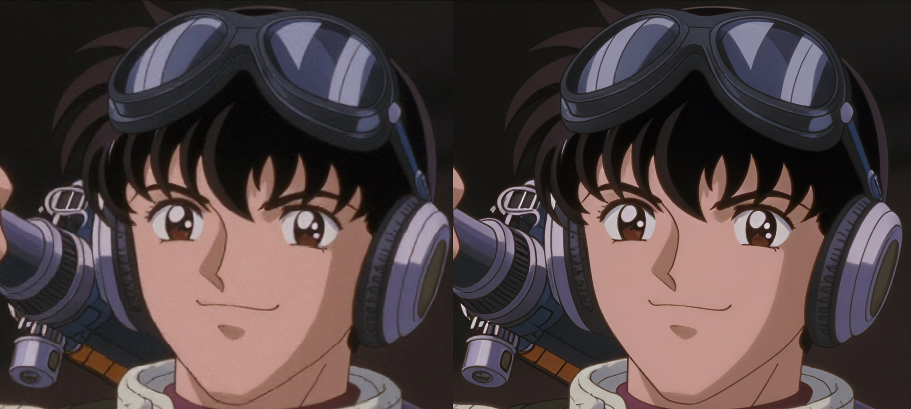

# JustRayzist


<br>Not feeling like ComfyUI? Too broke to get a monthly sub to an image platform?<br>
Got 35GB of space on a drive somewhere and an RTX card? <br>

### Enter Just Rayzist!
A lightweight, easy to install and easier to run app that just runs.<br>
Built around my Z-Image-Turbo finetune, it gives you a fast image generation platform, available through a local web page, command line or via local API so your favorite AI agents can use it.<br>
The main UI ships presets up to 1536x1536, the raw API accepts up to 2048x2048, and the default upscale path is SeedVR2 direct x2. <br>
It even has a built in prompt enhancement feature, a proper image browser, importable client galleries, and a Creative Mode slider when you want it to get a little weird.<br><br>



## New in v1.6.1

- hardens prompt enhancement fallback for very long prompts so explicit late style instructions are preserved instead of being dropped by raw truncation
- keeps prompt fitting inside the tokenizer-safe budget even when the enhanced candidate or original prompt is severely over budget
- adds regression coverage for late-style preservation and single-clause over-budget fallback handling

<p align="center">
  
</p>

## Specs

- FastAPI web API + browser UI
- Typer CLI
- Z-Image Turbo, and more specifically my very own finetune: [Rayzist](https://huggingface.co/MutantSparrow/Ray)
- local model packs (`.safetensors` / `.gguf`)
- Automatic resource-tier detection adapts memory strategy to available VRAM
- SeedVR2 direct x2 upscale flow for the default app path
- Creative Mode slider (`0-3`) for Light, Medium, and Extreme generation variants
- RunMeFirst bootstrap installation and auto-repair
- Run it locally or open it to LAN access
- Multi-user LAN workspaces with per-user gallery isolation and import support
- Model pack system to support custom Z-Image-Turbo models, VAEs or encoder models
- Managed multi-LoRA library support with up to 3 active LoRAs per generation
- PNG metadata writing and SQLite gallery indexing
- Web gallery with masonry layout, favorites, color swatch filtering, queued job recovery/cancel, fullscreen compare-hold, and `/API` testing page
- CLI workflows for generation, engineering-only mixed-model upscale probes, soak runs, soak reporting, SeedVR2 benchmarks, and procedural latent previews
- Lane-aware bootstrap packaging (`cu126`, `cu128`) with GPU driver preflight

The app is designed to run 100% without runtime internet dependencies once installed locally.

<p align="center">
  
</p>

## Tech Stack

- Python 3.11+
- PyTorch + CUDA wheels (`cu126`/`cu128`)
- Diffusers + Transformers + Accelerate
- FastAPI + Uvicorn
- Typer
- Pillow
- SQLite

## Requirements

- Windows is the primary supported workflow, including packaged releases and `UpdateApp.bat`.
- Linux and macOS source mode are supported through `RunMeFirst.sh` and `StartWeb.sh`.
- macOS support is best-effort source setup only; accelerated generation is not guaranteed.
- NVIDIA GPU strongly recommended for practical performance (CPU fallback is possible, but very slow).
- Internet access for first-time setup (Python/dependencies/model downloads; everything is fetched from Hugging Face).

### CUDA Lane Baseline

- `cu126`: NVIDIA driver `>= 561.17` (20xx/30xx/40xx fallback lane)
- `cu128`: NVIDIA driver `>= 572.61` (preferred lane; required for 50xx)

12, 16 and 24GB RTX cards supported: 20xx, 30xx, 40xx and 50xx series and up.<br>
Tested on 4090, 4080, 3090, 3060 Ti.<br>
It will work on 8GB cards provided you have enough system RAM, but it will slow down considerably.<br>
It *should* run purely on CPU thanks to smart offload but you *probably* do not want to do this.

## Installation

Windows from repository root:

```powershell
.\RunMeFirst.bat
```

Linux or macOS source mode from repository root:

```bash
./RunMeFirst.sh
```

The setup script will:
- create or repair `.venv`
- install runtime, SeedVR2, and dev dependencies
- install Hugging Face CLI + XET support in the environment
- fetch default model assets from Hugging Face
- fetch the bundled SeedVR2 runtime repository
- run `doctor` and `validate-models`

Windows `RunMeFirst.bat` also:
- installs Python 3.11 if missing
- selects the CUDA lane (`cu126` or `cu128`) from detected GPU/driver state
- creates the desktop shortcut

Linux source mode auto-selects CUDA requirements when `nvidia-smi` is available.
macOS source mode uses the non-CUDA torch requirements path.

Downloads are performed through Hugging Face CLI (`hf download`) with XET acceleration enabled (`HF_XET_HIGH_PERFORMANCE=1`), and each file is SHA256-verified before acceptance.

## Quick Start

Windows:

```powershell
.\StartWeb.bat
```

Linux or macOS source mode:

```bash
./StartWeb.sh
```
<br>
...or use the desktop shortcut.<br>
<br>
Launcher flow:

1. Select model pack only when more than one public enabled pack is installed.
2. Select if the server will listen to LAN connections.
3. Let the app auto-detect a memory strategy from current free VRAM.
4. Open `http://127.0.0.1:37717/`.

`StartWeb.sh` accepts `--host`, `--port`, and `--pack`.
If exactly one public enabled pack exists it auto-selects it; otherwise it prompts when a TTY is available or requires `--pack` / `JUSTRAYZIST_PACK`.

Normal startup no longer asks users to choose `high`, `balanced`, or `constrained`.
The app keeps a stable `balanced` behavior baseline for normal quality defaults, then
auto-detects an internal resource tier (`high`, `balanced`, or `constrained`) to pick
the safest execution/offload strategy for the hardware and current VRAM state.
That resource tier can downgrade or re-upgrade between requests as available VRAM changes.

Only public enabled packs appear in the launcher and `GET /model-packs`.
Bundled setup now provisions `Rayzist_bf16` only.
Derived FP8 storage remains an internal runtime strategy for constrained conditions; native FP8 inference is not implemented in the current release.
Hidden, disabled, or experimental packs remain loadable only when explicitly named for engineering work.

## Update Packaged Install

If you are using a packaged release folder instead of a git checkout, run:

```powershell
.\UpdateApp.bat
```

It checks the latest matching GitHub release for your current lane and mode, then updates the app in place without touching `models/`, `outputs/`, `data/`, `.venv/`, or your local lane marker.
## CLI Usage

Environment variables (used for CLI)

- `JUSTRAYZIST_ROOT`: override workspace root.
- `JUSTRAYZIST_PROFILE`: engineering-only runtime tier override for diagnostics and benchmarks.
- `JUSTRAYZIST_PACK`: default model pack name.
- `JUSTRAYZIST_OFFLINE`: `1` (default) enables offline env guards.
- `JUSTRAYZIST_ENV`: environment label (`dev` default).
- `JUSTRAYZIST_PYTHON`: optional interpreter override for source-mode launcher.
- `JUSTRAYZIST_LISTEN`: set `1` to force LAN listen mode from `StartWeb.bat` or `StartWeb.sh`.
- `JUSTRAYZIST_SKIP_GPU_PREFLIGHT`: set `1` to bypass lane/driver preflight in packaged mode.
<br><br>

From repository root:

```powershell
python -m app.cli.main status
python -m app.cli.main doctor
python -m app.cli.main validate-models
python -m app.cli.main validate-models --all
python -m app.cli.main serve --host 127.0.0.1 --port 37717
```

Generate:

```powershell
python -m app.cli.main generate --pack Rayzist_bf16 --prompt "cinematic skyline at sunrise"
```

Soak test:

```powershell
python -m app.cli.main soak --pack Rayzist_bf16 --prompt "stress prompt" --iterations 20
```

Soak report:

```powershell
python -m app.cli.main soak-report --list-sessions
python -m app.cli.main soak-report --session-id <session_id>
```

Normal CLI commands use auto resource-tier detection. Forced profile/tier flags are kept only on engineering benchmark and probe commands:

```powershell
python -m app.cli.main pack-compare --prompt "cinematic skyline at sunrise"
python -m app.cli.main pack-compare-suite --iterations 3
python -m app.cli.main prompt-grid-benchmark --pack Rayzist_bf16 --prompt "PROMPT 1" --prompt "PROMPT 2" --prompt "PROMPT 3"
python -m app.cli.main seedvr2-still-benchmark --inputs outputs\sample.png --presets seed_faithful,seed_sharp
```

Procedural latent preview:

```powershell
python -m app.cli.main procedural-latent-preview --count 16 --seed-start 1 --creativity 2
```

## API Summary

Base URL: `http://127.0.0.1:37717`

Supported generation cap: UI presets up to `1536x1536`; raw API requests up to `2048x2048`.
Client-scoped routes require `X-JustRayzist-Client`.
Use `procedural_creativity` (`0-3`) to control Creative Mode.
In the main UI, scheduler behavior is derived automatically from Creative Mode. `scheduler_mode` remains optional for raw API and CLI calls.
Direct image fetches can use `?client_id=<client-id>` if you are linking them into a page or tool.

<!-- BEGIN GENERATED API ROUTES -->
- `GET /health`
- `GET /config`
- `GET /model-packs`
- `GET /loras`
- `POST /lora-drafts`
- `POST /lora-drafts/{draft_id}/detect-triggers`
- `POST /loras`
- `PATCH /loras/{lora_id}`
- `GET /loras/{lora_id}/preview`
- `DELETE /loras/{lora_id}`
- `POST /generate`
- `POST /upscale`
- `POST /images/download-zip`
<!-- END GENERATED API ROUTES -->

- `GET /API` (interactive API documentation + tester)

`GET /health` and `GET /config` report both:
- `runtime_profile`: the stable baseline defaults used for normal behavior
- `resource_tier`: the currently detected internal memory strategy

`GET /model-packs` returns public packs only. Internal derived strategies such as `<base>__auto_fp8_storage` are engineering/runtime details, not normal user pack names.

<!-- BEGIN GENERATED API EXAMPLES -->
### `GET /health`

Service health plus current baseline/defaults and detected memory strategy.

Sample response:

```json
{
  "status": "ok",
  "app": "JustRayzist",
  "version": "1.6.1",
  "runtime_profile": "balanced",
  "resource_tier": "high",
  "active_pack": "Rayzist_bf16",
  "selected_pack": "Rayzist_bf16",
  "effective_pack": "Rayzist_bf16",
  "active_backend": "diffusers_zimage",
  "fp8_fallback_used": false,
  "fp8_fallback_reason": null,
  "fp8_runtime_mode": null,
  "fp8_storage_preserved_tensor_count": 0,
  "fp8_promoted_tensor_count": 0,
  "lora_capable": true,
  "gallery_color_cache_active": false,
  "gallery_color_cache_version": "dominant_v6",
  "gallery_color_cache_target_version": "dominant_v6",
  "gallery_color_cache_error": null,
  "offline_mode": true
}
```

### `GET /config`

Resolved runtime configuration, paths, and current runtime status.

Sample response:

```json
{
  "app_name": "JustRayzist",
  "app_version": "1.6.1",
  "environment": "dev",
  "offline_mode": true,
  "runtime_profile": {
    "name": "balanced",
    "description": "16GB-class profile with moderate offload and stable throughput."
  },
  "resource_tier": {
    "name": "high",
    "description": "24GB-class profile with minimal offload and highest throughput."
  },
  "resource_tier_override": null,
  "auto_resource_tier": true,
  "paths": {
    "root_dir": "S:\\STABLEDIFFUSION\\JustRayzist",
    "models_dir": "S:\\STABLEDIFFUSION\\JustRayzist\\models",
    "model_packs_dir": "S:\\STABLEDIFFUSION\\JustRayzist\\models\\packs",
    "outputs_dir": "S:\\STABLEDIFFUSION\\JustRayzist\\outputs",
    "data_dir": "S:\\STABLEDIFFUSION\\JustRayzist\\data",
    "ui_dir": "S:\\STABLEDIFFUSION\\JustRayzist\\app\\ui"
  },
  "runtime": {
    "runtime_profile": "balanced",
    "resource_tier": "high",
    "resource_tier_description": "24GB-class profile with minimal offload and highest throughput.",
    "resource_tier_override": null,
    "auto_resource_tier": true,
    "active_pack": "Rayzist_bf16",
    "selected_pack": "Rayzist_bf16",
    "effective_pack": "Rayzist_bf16",
    "active_backend": "diffusers_zimage",
    "execution_mode": "model_offload",
    "fp8_checkpoint": false,
    "fp8_fallback_used": false,
    "fp8_fallback_reason": null,
    "fp8_runtime_mode": null,
    "fp8_normalized_tensor_count": 0,
    "fp8_storage_preserved_tensor_count": 0,
    "fp8_promoted_tensor_count": 0,
    "lora_capable": true,
    "gallery_color_cache_active": false,
    "gallery_color_cache_version": "dominant_v6",
    "gallery_color_cache_target_version": "dominant_v6",
    "gallery_color_cache_error": null
  }
}
```

### `GET /model-packs`

List discovered, valid, public, and enabled model packs.

Sample response:

```json
{
  "count": 1,
  "items": [
    {
      "name": "Rayzist_bf16",
      "path": "S:\\STABLEDIFFUSION\\JustRayzist\\models\\packs\\Rayzist_bf16\\modelpack.yaml",
      "architecture": "z_image_turbo"
    }
  ]
}
```

### `GET /loras`

List installed LoRAs, preview URLs, saved trigger words, detected trigger suggestions, and runtime LoRA capabilities.

Sample response:

```json
{
  "count": 1,
  "items": [
    {
      "id": "cinematic-style",
      "display_name": "cinematic-style",
      "source_filename": "cinematic-style.safetensors",
      "preview_url": "/loras/cinematic-style/preview",
      "trigger_words": [
        "cinematic style"
      ],
      "detected_trigger_words": [
        "cinematic style",
        "moody light"
      ],
      "preview_is_custom": true,
      "metadata_summary": {
        "ss_output_name": "cinematic-style"
      },
      "file_size_bytes": 12345678
    }
  ],
  "capabilities": {
    "supported": true,
    "active_pack": "Rayzist_bf16",
    "max_active": 3,
    "min_weight": -2.0,
    "max_weight": 2.0,
    "default_weight": 1.0
  }
}
```

### `POST /lora-drafts`

Upload one `.safetensors` LoRA into draft storage for metadata inspection before saving it into the live library. LoRA uploads are capped at 10 GiB.

Sample request body:

```text
multipart/form-data with one file field named `file`
```

Sample response:

```json
{
  "status": "ok",
  "draft": {
    "draft_id": "cinematic-style",
    "display_name": "cinematic-style",
    "source_filename": "cinematic-style.safetensors",
    "detected_trigger_words": [
      "cinematic style",
      "moody light"
    ],
    "metadata_summary": {
      "ss_output_name": "cinematic-style"
    },
    "file_size_bytes": 12345678
  }
}
```

### `POST /lora-drafts/{draft_id}/detect-triggers`

Re-scan a staged LoRA draft for trigger words and metadata suggestions.

Sample response:

```json
{
  "status": "ok",
  "draft": {
    "draft_id": "cinematic-style",
    "display_name": "cinematic-style",
    "source_filename": "cinematic-style.safetensors",
    "detected_trigger_words": [
      "cinematic style",
      "moody light"
    ],
    "metadata_summary": {
      "ss_output_name": "cinematic-style"
    },
    "file_size_bytes": 12345678
  }
}
```

### `POST /loras`

Finalize a staged LoRA draft into the live library with a chosen name, saved trigger words, and an optional thumbnail image. Thumbnail uploads are capped at 10 MiB.

Sample request body:

```text
multipart/form-data with `draft_id`, `display_name`, `trigger_words` (JSON string), and optional `thumbnail` image
```

Sample response:

```json
{
  "status": "ok",
  "item": {
    "id": "cinematic-style",
    "display_name": "Cinematic Style",
    "source_filename": "cinematic-style.safetensors",
    "preview_url": "/loras/cinematic-style/preview",
    "preview_is_custom": true,
    "trigger_words": [
      "cinematic style",
      "moody light"
    ],
    "detected_trigger_words": [
      "cinematic style",
      "moody light"
    ],
    "metadata_summary": {
      "ss_output_name": "cinematic-style"
    },
    "file_size_bytes": 12345678
  },
  "capabilities": {
    "supported": true,
    "active_pack": "Rayzist_bf16",
    "max_active": 3,
    "min_weight": -2.0,
    "max_weight": 2.0,
    "default_weight": 1.0
  }
}
```

### `PATCH /loras/{lora_id}`

Update the display name, saved trigger words, and optional thumbnail image for one installed LoRA without replacing the weights file. Thumbnail uploads are capped at 10 MiB.

Sample request body:

```text
multipart/form-data with `display_name`, `trigger_words` (JSON string), and optional `thumbnail` image
```

Sample response:

```json
{
  "status": "ok",
  "item": {
    "id": "cinematic-style",
    "display_name": "Cinematic Style",
    "source_filename": "cinematic-style.safetensors",
    "preview_url": "/loras/cinematic-style/preview",
    "preview_is_custom": true,
    "trigger_words": [
      "cinematic style",
      "moody light"
    ],
    "detected_trigger_words": [
      "cinematic style",
      "moody light"
    ],
    "metadata_summary": {
      "ss_output_name": "cinematic-style"
    },
    "file_size_bytes": 12345678
  }
}
```

### `GET /loras/{lora_id}/preview`

Download the current preview image for one installed LoRA.

Sample response:

```text
PNG binary response
```

### `DELETE /loras/{lora_id}`

Delete one installed LoRA plus its sidecar JSON and preview image.

Sample response:

```json
{
  "status": "ok",
  "id": "cinematic-style",
  "deleted_files": 3
}
```

### `POST /generate`

Generate one image from prompt and dimensions in the current client scope.

Requires `X-JustRayzist-Client`.

Sample request body:

```json
{
  "job_id": "pending_1712345678901_abcd1234",
  "prompt": "A cinematic skyline at sunrise",
  "width": 1024,
  "height": 1024,
  "pack": "Rayzist_bf16",
  "seed": 123456,
  "scheduler_mode": "euler",
  "enhance_prompt": false,
  "procedural_creativity": 0,
  "loras": [
    {
      "id": "cinematic-style",
      "weight": 1.0
    }
  ]
}
```

Sample response:

```json
{
  "filename": "justrayzist_YYYYMMDD_hhmmss_000.png",
  "output_path": "S:\\STABLEDIFFUSION\\JustRayzist\\outputs\\example-client\\justrayzist_YYYYMMDD_hhmmss_000.png",
  "prompt": "A cinematic skyline at sunrise",
  "width": 1024,
  "height": 1024,
  "duration_ms": 12345,
  "url": "/images/justrayzist_YYYYMMDD_hhmmss_000.png",
  "prompt_enhanced": false,
  "prompt_effective_base": "A cinematic skyline at sunrise",
  "prompt_effective": "A cinematic skyline at sunrise, cinematic style",
  "scheduler_mode": "euler",
  "procedural_creativity": 0,
  "lora_count": 1,
  "loras": [
    {
      "id": "cinematic-style",
      "name": "cinematic-style",
      "weight": 1.0
    }
  ]
}
```

### `POST /upscale`

Upscale one gallery image with the fixed SeedVR2 direct x2 faithful path.

Requires `X-JustRayzist-Client`.

Sample request body:

```json
{
  "job_id": "pending_upscale_1712345678901_abcd1234",
  "filename": "justrayzist_YYYYMMDD_hhmmss_000.png",
  "pack": "Rayzist_bf16",
  "seed": 123456,
  "scheduler_mode": "euler",
  "enhance_prompt": false
}
```

Sample response:

```json
{
  "filename": "justrayzist_YYYYMMDD_hhmmss_001.png",
  "mode": "api_upscale",
  "source_filename": "justrayzist_YYYYMMDD_hhmmss_000.png",
  "upscale_engine": "seedvr2_direct_x2_faithful",
  "execution_mode": "seedvr2_direct_x2_faithful",
  "duration_ms": 23456,
  "url": "/images/justrayzist_YYYYMMDD_hhmmss_001.png"
}
```

### `POST /images/download-zip`

Download a ZIP archive containing the selected client-scoped images.

Requires `X-JustRayzist-Client`.

Sample request body:

```json
{
  "filenames": [
    "justrayzist_YYYYMMDD_hhmmss_000.png",
    "justrayzist_YYYYMMDD_hhmmss_001.png"
  ]
}
```

Sample response:

```text
ZIP binary response (attachment filename: <client>_selection.zip)
```
<!-- END GENERATED API EXAMPLES -->

The `/API` tester page uses the app's internal `GET /api-manifest` feed to stay aligned with the real handlers and current example payloads.

## Troubleshooting

See:

- `docs/USAGE.md`
- `docs/PACKAGING.md`
- `docs/TROUBLESHOOTING.md`
- `docs/CLONE_BUILD_CHECKLIST.md`

## Known Limitations

- Windows-first launcher/build flow.
- No authentication on client-scoped gallery endpoints, so keep LAN use to trusted machines.
- `/server/kill` is a destructive local control endpoint and should not be exposed beyond trusted networks.
- Runtime quality/performance depend on local model pack quality and GPU/driver compatibility.
- With multiple users on LAN or multiple web pages open, requests made in one place will only be picked up in the page when it next refreshes. (no push)

## License

This project is licensed under the Apache License 2.0.
See the [LICENSE](LICENSE) file for full terms.

## Acknowledgements

Default model assets are provided by the following model owners and repositories:

- MutantSparrow (Ray): https://huggingface.co/MutantSparrow/Ray
- Tongyi-MAI (Z-Image-Turbo): https://huggingface.co/Tongyi-MAI/Z-Image-Turbo
- ByteDance-Seed (SeedVR2-3B original): https://huggingface.co/ByteDance-Seed/SeedVR2-3B
- themindstudio (SeedVR2-3B FP8 quantized provider): https://huggingface.co/themindstudio/SeedVR2-3B-FP8-e4m3fn
- imagepipeline (superresolution/x2 upscaler): https://huggingface.co/imagepipeline/superresolution

Model weights remain under their respective upstream licenses and terms.


